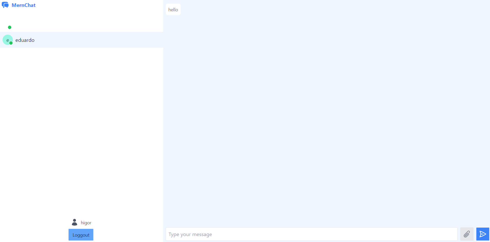

# :desktop_computer: Chat Application

## :briefcase: Stacks

✅ JavaScript
✅ Mongo
✅ Express
✅ React
✅ Node
✅ TailwindCSS

## :hammer: Tools

- Git (`git -v`)
- NodeJs (`node --version`/`npm --version`)
- Yarn (`npm install --global yarn`/`yarn --version`)
- VS Code

## :fire: Run

- Server Development (Port 3001): `yarn dev`
- Client Development (Port 3000): `yarn dev`

## :baby: Created

- Server: `yarn init -y`
- Client: `yarn create vite`
- Tailwind Project: `yarn tailwindcss init -p`

## :ok_man: Dependencies

- Server Dependecies: `yarn add bcryptjs cookie-parser dotenv express jsonwebtoken mongoose ws`
- Server Dev Dependencies: `yarn add -D nodemon`
- Client Dependencies: `yarn add axios lodash`
- Client Dev Dependencies: `yarn add -D autoprefixer postcss tailwind-scrollbar tailwindcss`

## :triangular_flag_on_post: Environment Variables

### Server Variables

- Port: `SERVER_PORT`
- Mongo: `MONGO_URL`
- Secret: `JWT_SECRET`
- Salt `BCRYPT_SALT`
- Client Address: `CLIENT_URL`

### Client Variables

- Server Address: `VITE_SERVER_URL`
- Socket: `VITE_WEBSOCKET_URL`

## :page_facing_up: Docs

<b>Documentações</b>

### :scroll: Documentações

- Axios: `https://axios-http.com/`
- React Icons: `https://react-icons.github.io/react-icons/`
- Router Dom: `https://reactrouter.com/en/main`
- Vite: `https://vitejs.dev/`
- Tailwindcss: `https://tailwindcss.com/`
- HeroIcons: `https://heroicons.com/`

