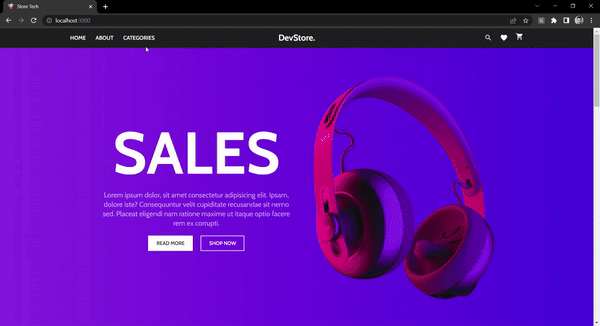

# :desktop_computer: Fiverr Jobs Application

## :briefcase: Stacks

✅ JavaScript
✅ React
✅ noSQL
✅ Stripe
✅ Strapi

## :hammer: Tools

- Git (`git -v`)
- NodeJs (`node --version`/`npm --version`)
- Yarn (`npm install --global yarn`/`yarn --version`)
- VS Code

## :fire: Run

- Api Development (Port 1337): `yarn develop`
- Client Development (Port 3000): `yarn dev`

## :baby: Created

- Api: ``yarn create strapi-app`
- Client: `yarn create vite`

## :ok_man: Dependencies

- Api Dependecies: `yarn add stripe`
- Client Dependencies: `yarn add @stripe/react-stripe-js @stripe/stripe-js axios react-icons react-router-dom sass`

## :triangular_flag_on_post: Environment Variables

### Api Variables

*Server:*

- Host: `HOST`
- Port: `PORT`
- Keys: `APP_KEYS`
- Salt: `API_TOKEN_SALT`
- Secret: `ADMIN_JWT_SECRET`
- Token Salt: `TRANSFER_TOKEN_SALT`

*Database:*

- Database: `DATABASE_CLIENT`
- Filename: `DATABASE_FILENAME`
- Secret: `JWT_SECRET`

*Stripe:*

- Stripe Private Key: `STRIPE_PRIVATE_KEY`
- Client Url: `CLIENT_URL`

### Client Variables

- Api Url: `VITE_STRAPI_API_URL`
- Api Token: `VITE_STRAPI_API_TOKEN`
- Stripe Public Key: `VITE_STRIPE_PUBLIC_KEY`

## :page_facing_up: Docs

<b>Documentações</b>

### :scroll: Documentações

- Axios: `https://axios-http.com/`
- React Icons: `https://react-icons.github.io/react-icons/`
- Strapi: `https://strapi.io/`
- Stripe: `https://stripe.com/`
- Router Dom: `https://reactrouter.com/en/main`
- Sass: `https://sass-lang.com/`

