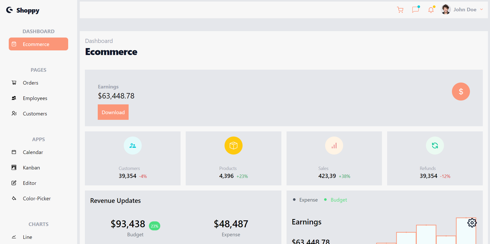
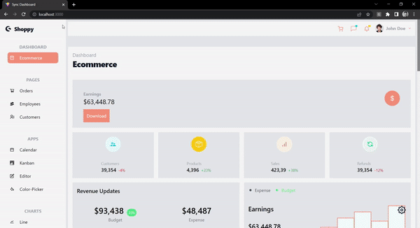

# :desktop_computer: Dashboard

## :briefcase: Stacks

✅ JavaScript
✅ React

## :fire: Run

- Dev Server (Port 3000): `yarn dev`

## :baby: Created

- React Project: `yarn create vite`
- Tailwind CSS: `yarn tailwindcss init -p`

## :ok_man: Dependencies

- Dependencies: `yarn add @syncfusion/ej2 @syncfusion/ej2-react-calendars @syncfusion/ej2-react-charts @syncfusion/ej2-react-dropdowns @syncfusion/ej2-react-grids @syncfusion/ej2-react-inputs @syncfusion/ej2-react-kanban @syncfusion/ej2-react-popups @syncfusion/ej2-react-richtexteditor @syncfusion/ej2-react-schedule react-icons react-router-dom`
- Dev Dependencies: `yarn add -D tailwindcss postcss autoprefixer`

## :page_facing_up: Docs

<b>Documentações</b>

### :scroll: Documentações

- Vite: `https://vitejs.dev/`
- Tailwind CSS: `https://tailwindcss.com/`
- Sync Fusion: `https://ej2.syncfusion.com/react/documentation/introduction`

