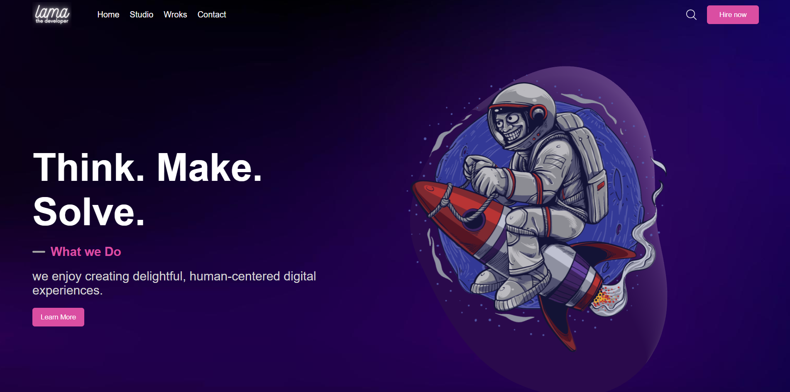
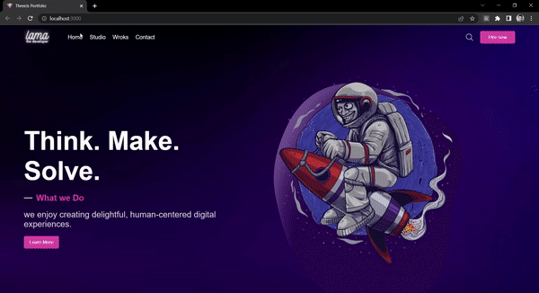

# :desktop_computer: Fiverr Jobs Application

## :briefcase: Stacks

✅ JavaScript
✅ React

## :hammer: Tools

- Git (`git -v`)
- NodeJs (`node --version`/`npm --version`)
- Yarn (`npm install --global yarn`/`yarn --version`)
- VS Code

## :fire: Run

- Client Development (Port 3000): `yarn dev`

## :baby: Created

- Client: `yarn create vite`

## :ok_man: Dependencies

- Dependencies: `yarn add @emailjs/browser @react-three/drei @react-three/fiber @react-three/postprocessing react-simple-maps styled-components three`

## :triangular_flag_on_post: Environment Variables

- EmailJs Service ID: `VITE_EMAILJS_SERVICE_ID`
- EmailJs Template ID: `VITE_EMAILJS_TEMPLATE_ID`
- EmailJs Public Key: `VITE_EMAILJS_PUBLIC_KEY`

## :page_facing_up: Docs

<b>Documentações</b>

### :scroll: Documentações

- Vite: `https://vitejs.dev/`
- Simple Maps: `https://www.react-simple-maps.io/`
- EmailJs: `https://www.emailjs.com/`
- Three: `https://threejs.org/`
- Three Fiber: `https://docs.pmnd.rs/react-three-fiber/getting-started/introduction`
- Skechfab: `https://sketchfab.com/`
- glTF: `https://www.npmjs.com/package/gltf-pipeline`
- glTFjsx: `https://github.com/pmndrs/gltfjsx`

