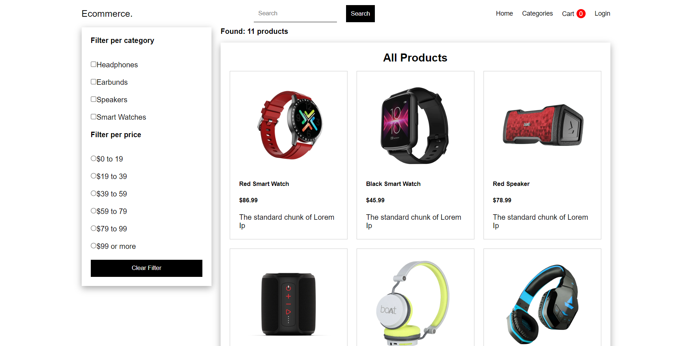
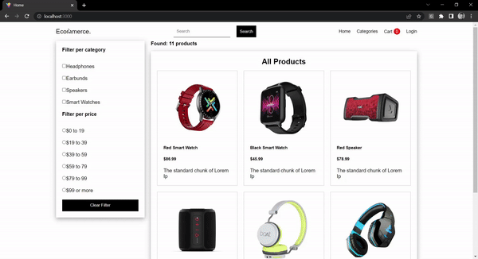

# :desktop_computer: Store Tech Application

## :briefcase: Stacks

✅ JavaScript
✅ React
✅ NodeJs
✅ Express
✅ noSQL
✅ MongoDB

## :hammer: Tools

- Git (`git -v`)
- NodeJs (`node --version`/`npm --version`)
- VS Code
- Yarn (`npm install --global yarn`/`yarn --version`)

## :fire: Run

- Dev Server (Port 3001): `yarn server`
- Dev Client (Port 3000): `yarn dev`

## :baby: Created

- Server: `yarn init -y`
- Client: `yarn create vite`

## :ok_man: Dependencies

- Server Dependencies: `yarn add bcrypt braintree colors concurrently cors dotenv express express-formidable express-validation jsonwebtoken mongoose morgan nodemon slugify`
- Client Dependencies: `yarn add axios braintree-web-drop-in-react react react-dom react-helmet react-hot-toast react-router-dom`

## :triangular_flag_on_post: Environment Variables

### Server Variables

- Api Port: `API_PORT`
- MongoDB (Database): `DATABASE_URL`
- Secret JWT: `JWT_SECRET`

- Braintree Merchant ID : `PAYMENT_MERCHANT_ID`
- Braintree Prublic Key: `PAYMENT_PUBLIC_KEY`
- Braintree Private Key: `PAYMENT_PRIVATE_KEY`

### Client Variables

- Api Url (API): `VITE_API_URL`

## :page_facing_up: Docs

<b>Documentações</b>

### :scroll: Documentações

- BCrypt: `https://www.npmjs.com/package/bcrypt`
- Colors: `https://www.npmjs.com/package/colors`
- Express: `https://expressjs.com/`
- Mongoose: `https://mongoosejs.com/`
- Dotenv: `https://www.npmjs.com/package/dotenv`
- JsonWebToken: `https://www.npmjs.com/package/jsonwebtoken`
- Morgan: `https://www.npmjs.com/package/morgan`
- Nodemon: `https://www.npmjs.com/package/nodemon`
- BrainTree: `https://www.braintreepayments.com/`
- Concurrently: `https://www.npmjs.com/package/concurrently`
- Axios: `https://axios-http.com/`
- React Icons: `https://react-icons.github.io/react-icons/`

